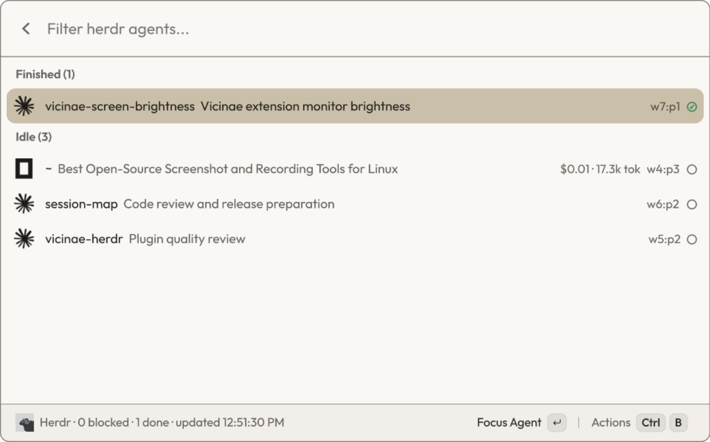
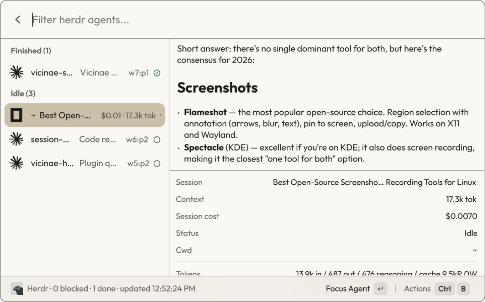

# Herdr Status for Vicinae

See which [Herdr](https://herdr.dev) coding agents need input (`blocked`) or
finished (`done`) — local and remote machines — without leaving
[Vicinae](https://vicinae.com).

Each agent row shows live session cost for OpenCode and Pi sessions: spend
rounded to cents and the current context size, matching the OpenCode footer.





## Commands

### Herdr Agent Status

Agents grouped by status — **Needs input**, **Finished**, **Working**, **Idle** —
auto-refreshing. Each row shows the agent's logo, its project folder (prefixed
with the machine for remote agents, e.g. `laptop:my-app`), the session title,
cost, and a status icon; the full path is in the detail panel. Search matches the project, path,
session title, agent, and machine.

Remote machines configured in herdr are queried too; unreachable ones are named
in the title bar. If a poll fails, the last known state stays visible.

| Action | Shortcut |
| --- | --- |
| Focus Agent (jumps to the pane, marks it seen) | `Enter` |
| Copy Last Response | `Ctrl+Shift+C` |
| Copy Terminal Output | `Ctrl+Shift+T` |
| Copy Pane ID | |
| Show / Hide Details | `Ctrl+D` |
| Refresh | `Ctrl+R` |

**Copy Last Response** copies the agent's last message as clean Markdown,
read from the agent's own session store (OpenCode, Pi, Claude Code) — no
terminal borders, reasoning, or tool calls. For other agents and remote
machines it falls back to the terminal output with TUI borders stripped.

**Show Details** opens a side panel with the selected agent's last response,
rendered as Markdown, next to its status, session and cost. It follows along
while the agent is working.

## Requirements

- [Herdr](https://herdr.dev) installed (`curl -fsSL https://herdr.dev/install.sh | sh`)
  with its server running (`herdr`).
- Nothing else. OpenCode cost is read with Node's built-in `node:sqlite`
  (bundled with Vicinae's extension runtime); if it is unavailable, rows simply
  show no cost.

## Preferences

- **Herdr binary** — path to `herdr`. The default `herdr` tries
  `~/.local/bin/herdr` (the installer's location) first, then `PATH`.
- **Refresh interval** — how often the status view polls (default 5 seconds).

## Cost sources

Cost data is read locally and read-only; nothing leaves your machine.

- **OpenCode** — exact `cost` and token counters from
  `$XDG_DATA_HOME/opencode/opencode.db` (default `~/.local/share`); context =
  latest step total, the same number as the OpenCode footer.
- **Pi** — sums per-message `usage.cost.total` and tokens from
  `~/.pi/agent/sessions/*/*.jsonl`; session title = first prompt.

Agents on remote machines currently show no cost (their session data lives on
the remote host).

## Develop

```sh
npm install
npm run dev     # live-reloading development mode
npm run build   # typechecks and installs to Vicinae
npm run lint
```

## Agent icons

Logos for OpenCode, Claude, Gemini, GitHub Copilot, Cursor, Cline, Qwen, and
Kimi come from [Simple Icons](https://simpleicons.org) (v16.32.0). Agents
without a freely available logo get a monogram badge generated by
`scripts/generate-monograms.mjs`. All product names and logos are trademarks
of their respective owners and are used only to identify the agent.
